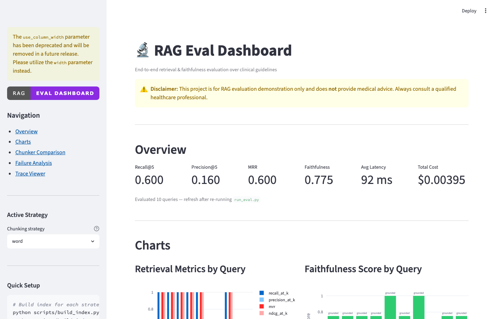
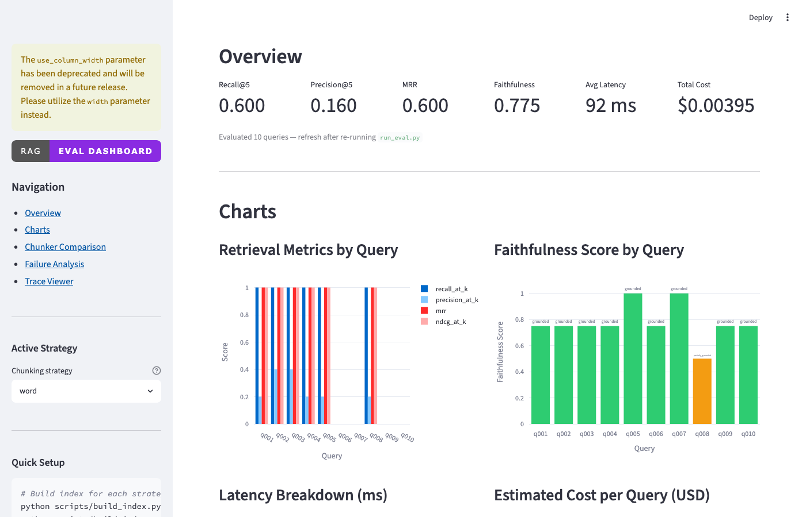
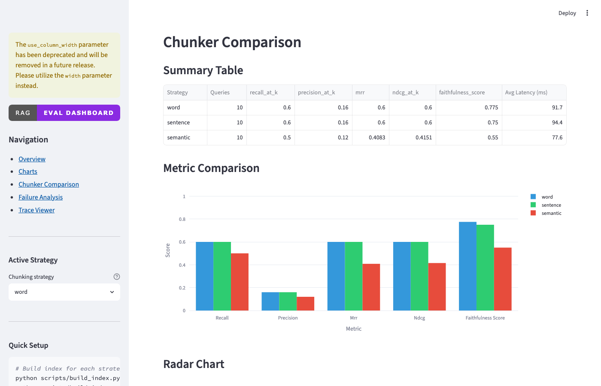
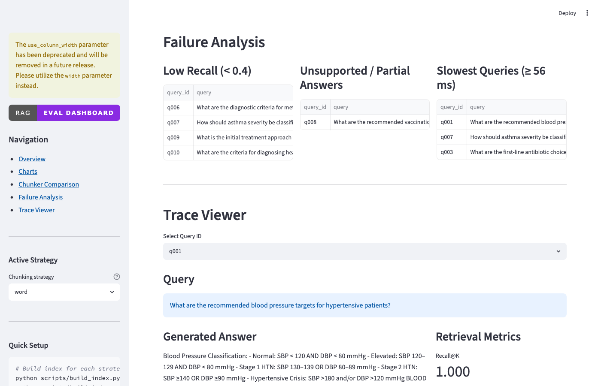

# RAG Eval Dashboard

> **Disclaimer:** This project is for RAG evaluation demonstration only and does **not** provide medical advice. Always consult a qualified healthcare professional.

A production-style evaluation dashboard for Retrieval-Augmented Generation (RAG) systems, built over a small public clinical guideline corpus. The goal is not to build the most advanced RAG system — it's to demonstrate **how to rigorously evaluate one**: retrieval quality, answer faithfulness, latency, cost, and traceability.


---

## Why RAG Evaluation Matters

Most RAG demos stop at "does it answer the question?" Production systems need more:

| Dimension | Why it matters |
|-----------|---------------|
| **Recall@K** | Did retrieval surface the right chunks at all? |
| **Precision@K** | Did retrieval stay focused, or was noise retrieved? |
| **MRR** | Was the best chunk ranked first? |
| **Faithfulness** | Does the answer only say what the sources support? |
| **Latency** | Is each pipeline stage contributing to slowness? |
| **Cost** | How much does each query cost at scale? |
| **Traceability** | Can you audit why a specific answer was generated? |

This dashboard puts all of that in one place.

---

## Architecture

```
data/raw/*.txt|*.md
      │
      ▼
  [ingest.py]          ← loads documents
      │
      ▼
  [chunking.py]        ← three strategies (word / sentence / semantic)
      │                   word:     fixed word windows with overlap
      │                   sentence: groups whole sentences up to word budget
      │                   semantic: splits on embedding similarity drops
      ▼
  [embeddings.py]      ← sentence-transformers (local, no API key)
      │
      ▼
  [vector_store.py]    ← FAISS IndexFlatIP (cosine similarity)
      │
      ▼
  [retriever.py]       ← top-k chunk retrieval
      │
      ▼
  [reranker.py]        ← optional cross-encoder reranking (NoOp by default)
      │
      ▼
  [generator.py]       ← OpenAI (if key set) or extractive fallback
      │
      ▼
  [judge.py]           ← LLM-as-judge faithfulness scoring (or lexical fallback)
      │
      ▼
  [metrics.py]         ← Recall@K, Precision@K, MRR, nDCG@K
      │
      ▼
  [tracing.py]         ← writes runs/traces_{strategy}.jsonl
      │
      ▼
  [pipeline.py]        ← orchestrates everything, writes eval_results_{strategy}.jsonl
      │
      ▼
  [app.py]             ← Streamlit dashboard (strategy selector + comparison section)
```

---

## Project Structure

```
rag-eval-dashboard/
├── app.py                              # Streamlit dashboard
├── requirements.txt
├── .env.example
│
├── data/
│   ├── raw/                            # .txt/.md guideline files
│   ├── processed/
│   │   ├── chunks.jsonl                # word strategy (generated)
│   │   ├── chunks_sentence.jsonl       # sentence strategy (generated)
│   │   ├── chunks_semantic.jsonl       # semantic strategy (generated)
│   │   ├── embeddings/                 # FAISS index — word
│   │   ├── embeddings_sentence/        # FAISS index — sentence
│   │   └── embeddings_semantic/        # FAISS index — semantic
│   └── eval/
│       ├── eval_set.csv                # Labeled queries (word chunk IDs)
│       ├── eval_set_sentence.csv       # Auto-remapped for sentence strategy
│       └── eval_set_semantic.csv       # Auto-remapped for semantic strategy
│
├── src/
│   ├── config.py           # Central config + strategy-aware path helpers
│   ├── chunking.py         # word / sentence / semantic chunkers
│   ├── embeddings.py       # sentence-transformers embedding
│   ├── vector_store.py     # FAISS wrapper
│   ├── retriever.py        # Top-k retrieval
│   ├── reranker.py         # NoOp + CrossEncoder reranker
│   ├── generator.py        # OpenAI or extractive fallback
│   ├── judge.py            # Faithfulness judge (LLM or lexical)
│   ├── metrics.py          # Recall@K, Precision@K, MRR, nDCG@K
│   ├── tracing.py          # Per-query trace logging
│   ├── cost.py             # Token counting + cost estimation
│   └── pipeline.py         # End-to-end eval loop
│
├── scripts/
│   ├── build_index.py          # Build FAISS index  (--chunker word|sentence|semantic)
│   ├── run_eval.py             # Run evaluation     (--chunker ... | --compare)
│   ├── remap_eval_set.py       # Remap eval ground truth for a new strategy
│   └── sample_eval_set.py      # Generate and browse eval_set.csv
│
└── runs/
    ├── eval_results.jsonl           # word strategy results   (committed)
    ├── eval_results_sentence.jsonl  # sentence results        (committed)
    └── eval_results_semantic.jsonl  # semantic results        (committed)
```

---

## Setup

### 1. Clone and install dependencies

```bash
git clone https://github.com/YOUR_USERNAME/rag-eval-dashboard
cd rag-eval-dashboard

python -m venv .venv
source .venv/bin/activate       # Windows: .venv\Scripts\activate

pip install -r requirements.txt
```

> **Note:** `faiss-cpu` and `sentence-transformers` will download model weights (~90 MB) on first run. This is cached locally after that.

### 2. Configure environment (optional)

```bash
cp .env.example .env
# Edit .env to add your OPENAI_API_KEY if you want LLM generation + judging
# The project runs fully without an API key using local models + extractive fallback
```

---

## How to Add Documents

Drop any `.txt` or `.md` files into `data/raw/`. The ingest pipeline supports both formats. Subdirectories are supported (e.g., `data/raw/cardiology/guidelines.txt`).

Requirements:
- Plain text or Markdown
- UTF-8 encoding
- No private or proprietary patient data

Example sources (public domain):
- CDC clinical guidelines
- WHO treatment guidelines
- USPSTF recommendations (uspreventiveservicestaskforce.org)
- NIH clinical practice guidelines

---

## Chunking Strategies

Three strategies are available, each producing its own index and eval results so you can compare them directly.

| Strategy | How it splits | Chunks (5 docs) | Typical use case |
|----------|--------------|-----------------|-----------------|
| **word** | Fixed word windows with overlap | ~10 | Baseline; fast but may cut mid-sentence |
| **sentence** | Groups whole sentences up to word budget | ~11 | Better context coherence; clean boundaries |
| **semantic** | Splits on embedding cosine-similarity drops | ~74 | Topic-aware; fine-grained; best for dense docs |

**Sentence-aware** splits on `.`, `!`, `?` boundaries while skipping abbreviations (`Dr.`, `e.g.`, `i.e.`), so every chunk starts and ends on a complete thought. This gives the embedding model cleaner text to represent.

**Semantic** embeds every sentence with the same local model and starts a new chunk when adjacent-sentence cosine similarity drops below `0.4` (a topic shift). Chunks reflect actual topic coherence rather than an arbitrary word count.

## Benchmark Results

Evaluated on 10 clinical guideline queries, `all-MiniLM-L6-v2` embeddings, Top-K=5, no reranker, extractive generation fallback (no OpenAI key required).

| Strategy | Recall@5 | Precision@5 | MRR | nDCG@5 | Faithfulness | Avg Latency | Cost/10q |
|----------|----------|-------------|-----|--------|--------------|-------------|----------|
| **word** | 0.600 | 0.160 | 0.600 | 0.600 | 0.775 | 91.7 ms | $0.003949 |
| **sentence** | 0.600 | 0.160 | 0.600 | 0.600 | 0.750 | 94.4 ms | $0.003718 |
| **semantic** | 0.500 | 0.120 | 0.408 | 0.415 | 0.550 | 77.5 ms | $0.001048 |

**Key takeaways:**
- Word and sentence strategies tie on retrieval metrics for this small corpus because the documents are short (~600 words each) and 2-chunk-per-doc granularity is the same either way.
- Semantic splits the corpus into 74 fine-grained chunks — at Top-5 the relevant chunk may fall outside the retrieval window, hurting recall. On a larger corpus with more topical diversity, semantic typically wins.
- Semantic is **5× cheaper and 15% faster** because smaller chunks produce shorter generation context.
- Faithfulness drops with semantic because the extractive fallback struggles with highly fragmented text; with an LLM judge the gap would be smaller.

> Results are pre-committed in `runs/eval_results*.jsonl` — you can verify by running `python scripts/run_eval.py --compare`.

## How to Build the Index

Build an index for a specific strategy (or all three):

```bash
python scripts/build_index.py --chunker word
python scripts/build_index.py --chunker sentence
python scripts/build_index.py --chunker semantic
```

Each strategy saves to its own directory (`data/processed/embeddings_sentence/`, etc.) so they don't overwrite each other.

Optional: use a different embedding model:
```bash
python scripts/build_index.py --chunker sentence --model all-mpnet-base-v2
```

---

## How to Create and Edit the Eval Set

### Generate a starter CSV

```bash
python scripts/sample_eval_set.py --create
```

This writes `data/eval/eval_set.csv` with 10 sample queries (relevant IDs left blank).

### Browse chunk IDs to annotate

```bash
python scripts/sample_eval_set.py
```

This prints the first 50 chunk IDs with text previews. Search by keyword:

```bash
python -c "
import sys; sys.path.insert(0, '.')
from src.chunking import load_chunks
chunks = load_chunks()
kw = 'blood pressure'
for c in chunks:
    if kw.lower() in c.text.lower():
        print(c.chunk_id, '|', c.text[:100])
"
```

### Edit the CSV

Open `data/eval/eval_set.csv` in any spreadsheet app or text editor.

Fill in `relevant_chunk_ids` using pipe-separated IDs:

```csv
query_id,query,relevant_chunk_ids,expected_answer_notes
q001,What are the recommended blood pressure targets?,hypertension_guidelines_chunk0001_abc1|hypertension_guidelines_chunk0002_def2,Targets for most adults...
```

The `expected_answer_notes` column is for human reference only — it is not used in automated evaluation.

---

## How to Run Evaluation

```bash
# Run for a specific strategy (index must be built first)
python scripts/run_eval.py --chunker word
python scripts/run_eval.py --chunker sentence
python scripts/run_eval.py --chunker semantic

# Print a side-by-side comparison of all built strategies
python scripts/run_eval.py --compare
```

Other options:
```bash
python scripts/run_eval.py --chunker word --k 5        # top-5 retrieval (default)
python scripts/run_eval.py --chunker word --fresh      # clear previous traces first
python scripts/run_eval.py --chunker word --rerank     # enable cross-encoder reranking
```

Output per strategy:
- `runs/eval_results_{strategy}.jsonl` — one result row per query (committed to repo)
- `runs/traces_{strategy}.jsonl` — full pipeline trace per query (gitignored, too verbose)

---

## How to Open the Dashboard

```bash
streamlit run app.py
```

Open your browser to `http://localhost:8501`.

Dashboard sections:
- **Overview** — aggregate metrics for the selected strategy
- **Charts** — retrieval, faithfulness, latency, cost (interactive Plotly)
- **Chunker Comparison** — grouped bar chart + radar chart across all three strategies
- **Failure Analysis** — queries with low recall, unsupported answers, slow responses
- **Trace Viewer** — drill into any query: chunks, answer, judgment, timing

Use the **strategy selector** in the sidebar to switch between word / sentence / semantic views.

---

## Screenshots

| Overview & strategy selector | Charts — retrieval + faithfulness |
|---|---|
|  |  |

| Chunker Comparison — table + bar chart | Failure Analysis & Trace Viewer |
|---|---|
|  |  |

---

## Configuration

Edit `src/config.py` to change:

| Setting | Default | Description |
|---------|---------|-------------|
| `CHUNK_SIZE` | 400 | Words per chunk |
| `CHUNK_OVERLAP` | 80 | Overlap between chunks |
| `EMBEDDING_MODEL` | `all-MiniLM-L6-v2` | Local embedding model |
| `TOP_K` | 5 | Chunks retrieved per query |
| `OPENAI_MODEL` | `gpt-4o-mini` | OpenAI model for generation + judging |
| `COST_PER_1K_INPUT` | 0.00015 | USD per 1K input tokens |
| `COST_PER_1K_OUTPUT` | 0.00060 | USD per 1K output tokens |

---

## Running Without an OpenAI Key

The project is fully functional without an API key:

| Component | With OpenAI | Without OpenAI |
|-----------|------------|----------------|
| Embeddings | sentence-transformers (local) | sentence-transformers (local) |
| Answer generation | GPT-4o-mini | Extractive fallback (keyword-ranked sentences) |
| Faithfulness judge | GPT-4o-mini (structured JSON) | Lexical overlap scoring |

The fallback outputs are deterministic and clearly labeled in the traces.

---

## Resume Bullet Points

Use these to describe this project on your resume or LinkedIn:

- Built a **production-style RAG evaluation pipeline** in Python, measuring Recall@K, Precision@K, MRR, nDCG, and LLM-as-judge faithfulness scoring across a clinical guideline corpus
- Implemented and benchmarked **three chunking strategies** (word-level, sentence-aware, semantic topic-shift detection) with automatic ground-truth remapping across strategies, revealing semantic chunking's 5× cost reduction trade-off against recall
- Designed a **Streamlit dashboard** with interactive strategy comparison (radar chart + grouped bar), failure analysis, and drill-down trace viewer enabling rapid debugging of retrieval and generation quality
- Implemented **per-query tracing** (retrieval → reranking → generation → judging) with structured JSONL logs capturing latency breakdown and token cost per stage
- Built dual-mode system supporting **OpenAI (gpt-4o-mini) for full LLM evaluation** and a deterministic lexical fallback for local-only execution without API keys
- Used **FAISS + sentence-transformers** for fully local vector retrieval with stable chunk IDs for reproducible evaluation across chunking configurations

---

## Future Improvements

- [x] **Sentence-aware chunking**: splits on sentence boundaries, respects abbreviations
- [x] **Semantic chunking**: topic-shift detection via embedding cosine similarity
- [x] **Cross-strategy comparison**: dashboard radar chart + grouped bar chart
- [ ] **Hybrid retrieval**: combine BM25 (sparse) + dense vectors for better recall
- [ ] **More embedding models**: compare MiniLM vs. BGE vs. E5 in the dashboard
- [ ] **Recursive character splitter**: LangChain-style splitter with paragraph → sentence fallback
- [ ] **Ragas integration**: add Ragas framework metrics alongside custom metrics
- [ ] **Multi-turn evaluation**: evaluate conversational RAG with query rewriting
- [ ] **Human feedback loop**: add thumbs-up/down in the dashboard to build gold labels
- [ ] **Batch evaluation**: parallelize eval queries with async API calls
- [ ] **Docker support**: containerize for easy deployment
- [ ] **CI eval gate**: run eval in CI and fail if Recall@5 drops below threshold

---

## License

MIT
